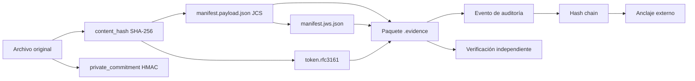

# 🛡️ EVIDENCE INTEGRITY OS

<div align="center">

```text
╔══════════════════════════════════════════════════════════════╗
║   E V I D E N C E   I N T E G R I T Y   O S                  ║
║   ─── cadena de custodia digital verificable ───             ║
╚══════════════════════════════════════════════════════════════╝
```

**Plataforma de integridad, trazabilidad y verificación de evidencia digital para México y Latinoamérica.**

`[ HASH ]` SHA-256 + HMAC · `[ TIME ]` RFC 3161 · `[ PROOF ]` `.evidence` · `[ AUDIT ]` Hash Chain


</div>

> [!WARNING]
> **Aviso importante:** Evidence Integrity OS no sustituye a un abogado, perito, notario ni Prestador de Servicios de Certificación (PSC). Los sellos RFC 3161 y las constancias NOM-151 son emitidos exclusivamente por terceros autorizados.

---

## `01 // MISIÓN`

Preservar evidencia digital de forma **verificable, trazable y exportable**, minimizando la necesidad de confiar ciegamente en una sola plataforma.

```text
ARCHIVO ORIGINAL
      │
      ├── content_hash       (SHA-256, verificable por terceros)
      ├── private_commitment (HMAC-SHA256 vía KMS, prueba privada)
      ├── token.rfc3161      (TSA externa, vinculado al hash)
      ├── evidence-report.pdf (PAdES-B-T: firma + sello de tiempo)
      └── evento encadenado + anclaje externo
      │
      ▼
PAQUETE .evidence VERIFICABLE
```

## `02 // QUÉ HACE`

| Módulo | Función |
|--------|---------|
| 📦 Paquete `.evidence` | Convierte archivos en paquetes verificables e independientes. |
| 🔒 Integridad | Calcula `content_hash` (SHA-256) y `private_commitment` (HMAC, prueba privada). |
| 🕐 Tiempo | Integra sellos RFC 3161 emitidos por una TSA externa. |
| 📄 Reporte | Genera `evidence-report.pdf` con firma PAdES-B-T (firma + sello de tiempo). |
| ⛓️ Auditoría | Registra eventos en una hash chain con anclaje externo. |
| 🌐 Verificación | Ofrece consulta pública mínima, solo con consentimiento explícito. |
| 💳 Pagos | Gestiona órdenes, webhooks e idempotencia para la emisión. |

## `03 // LÍMITES DEL SISTEMA`

| Este sistema sí | Este sistema no |
|-----------------|-----------------|
| Vincula un hash con una fecha/hora verificable mediante token RFC 3161 emitido por una TSA externa. | No certifica autoría, titularidad ni veracidad del contenido. |
| Conserva artefactos criptográficos para revisión independiente. | No emite constancias NOM-151 (solo un PSC acreditado puede hacerlo). |
| Mantiene trazabilidad operativa y eventos auditables. | No garantiza la admisibilidad judicial de una prueba. |
| Facilita verificación técnica reproducible por terceros. | No sustituye asesoría jurídica, pericial o notarial. |

> [!CAUTION]
> La valoración de una evidencia depende del contexto, la cadena de custodia, la normativa aplicable y la autoridad competente.

## `04 // CONTENIDO DE UN PAQUETE .evidence`

```text
paquete.evidence
├── manifest.payload.json       # Metadatos y hashes canónicos (JCS, RFC 8785)
├── manifest.jws.json           # Firma JWS detached (RFC 7797, b64=false)
├── token.rfc3161               # Sello de tiempo RFC 3161 (ASN.1)
├── evidence-report.pdf         # Reporte técnico PAdES-B-T (no es certificado legal)
├── proofs/                     # Anclaje de hash chain y estado de revocación
│   ├── anchor_<position>.json
│   └── ocsp.der
├── signatures/                 # Cadena de confianza de firma
│   ├── signing_cert.pem
│   └── ca_chain.pem
├── original/                   # OPCIONAL, desactivado por defecto en MVP
└── README.txt                  # Instrucciones de verificación
```

> **Sobre `evidence-report.pdf`**: es un documento técnico legible. **No es un certificado legal, no es una FEA, no es una constancia NOM-151.** Su firma PAdES-B-T acredita integridad del propio PDF y vinculación temporal.

> **Sobre el archivo original**: **no se incluye por defecto**. El MVP lo desactiva. Verificar la estructura, firmas y sellos **no requiere el original**. Comparar un archivo específico contra el paquete **sí requiere recalcular su `content_hash`**.

### Nota sobre perfiles PAdES

- **PAdES-B-B**: firma sin sello de tiempo.
- **PAdES-B-T** (MVP): firma + sello de tiempo RFC 3161.
- **PAdES-B-LT**: B-T + OCSP/CRL **incorporados dentro del PDF** según ETSI EN 319 142-1.
- **PAdES-B-LTA**: B-LT + sellos de archivo periódicos.

El MVP usa **B-T**. Un `ocsp.der` guardado en `proofs/` **no convierte** el PDF en B-LT; para ello el material de validación debe embeberse en el propio PDF.

## `05 // ARQUITECTURA DE CONFIANZA`



### Naturaleza de las pruebas

| Elemento | Naturaleza | Verificable por |
|----------|-----------|-----------------|
| `content_hash` (SHA-256) | Prueba pública e interoperable | Cualquiera con el archivo original |
| `private_commitment` (HMAC) | Prueba privada controlada por el sistema | Solo el sistema/titular autorizado |
| `token.rfc3161` | Vinculación temporal emitida por TSA externa | Cualquiera con el token |
| `manifest.jws.json` | Firma de integridad del manifiesto | Cualquiera con la clave pública |
| `evidence-report.pdf` | Reporte técnico con firma PAdES-B-T | Cualquiera con Adobe Reader o equivalente |

> **Sobre el HMAC**: `private_commitment` es una prueba privada que aporta control adicional del titular. **No protege al `content_hash` público contra ataques de diccionario.** Si el archivo tiene baja entropía, el `content_hash` público sigue siendo comprobable por terceros mediante diccionario.

## `06 // MARCO DE REFERENCIA`

### Alineación de diseño con normativa mexicana

> **"Alineación de diseño"** significa que el sistema se construye considerando estas normas. **No implica cumplimiento certificado, ni admisibilidad automática, ni respaldo oficial.**

- **NOM-151-SCFI-2016** (publicada en DOF el 30 de marzo de 2017) — conservación de mensajes de datos. La constancia la emite un PSC acreditado ante la Secretaría de Economía.
- **Código de Comercio, Art. 97** — uso de firma electrónica en mensajes de datos.
- **Código Nacional de Procedimientos Penales, Art. 265** — valoración de datos y pruebas.
- **LFPDPPP** — protección de datos personales en posesión de particulares.

### Estándares internacionales de referencia

- **RFC 3161** — Protocolo de sellado de tiempo (TSP).
- **RFC 8785** — JSON Canonicalization Scheme (JCS).
- **RFC 7797** — JWS Unencoded Payload Option.
- **RFC 7515 / 7518 / 7638** — JWS, algoritmos, thumbprints de clave.
- **ETSI EN 319 142-1** — Perfiles PAdES.
- **ISO/IEC 27001** — referencia de diseño.
- **ISO/IEC 27037** — referencia técnica forense.

> Ninguna de estas referencias implica certificación.

## `07 // ESTADO DEL PROYECTO`

| Componente | Estado |
|------------|--------|
| Especificación de manifest v1 | ✅ Congelada |
| Especificación de JWS detached | ✅ Congelada |
| Arquitectura de pagos | ✅ Congelada |
| Migraciones SQL | 🔄 2/5 aprobadas (0001, 0002) |
| Código Python | ⬜ Pendiente |
| Pruebas automatizadas | ⬜ Pendiente |
| Operación manual documentada | ✅ Disponible |
| Revisión legal México | ⚠️ Bloqueante externo |
| Núcleo criptográfico (parcial) | 🔄 hashing, JCS, manifest, JWS implementados; falta timestamp, hash chain, builder y verificador |

## `08 // DEMO`

⏳ **Despliegue pendiente.** La landing pública se publicará cuando el repositorio complete su revisión técnica y legal.

## `09 // USO MANUAL`

Guía paso a paso para operación sin terminal: [`docs/tutorials/01-uso-manual.md`](docs/tutorials/01-uso-manual.md).

## `10 // SEGURIDAD Y PRIVACIDAD`

Si detectas una vulnerabilidad, **no publiques detalles sensibles en un issue público**. Consulta [`SECURITY.md`](SECURITY.md) para el canal de reporte responsable.

- Minimización de datos.
- Control de acceso por rol.
- Cifrado en tránsito y en reposo.
- Registro de accesos y operaciones.
- Políticas de retención y eliminación.
- Revisión con especialistas en LFPDPPP.

## `11 // HOJA DE RUTA`

- [x] Definir `manifest.payload.json` v1.
- [x] Documentar límites legales y no-objetivos.
- [x] Diseñar modelo de órdenes, eventos y fulfillments.
- [x] Congelar arquitectura de pagos.
- [ ] Finalizar migraciones SQL versionadas (2/5 aprobadas).
- [ ] Implementar núcleo criptográfico (hashing, JCS, JWS, TSA).
- [ ] Implementar empaquetado `.evidence`.
- [ ] Implementar verificador independiente (CLI).
- [ ] Añadir pruebas de corrupción, duplicados y confusión de algoritmos.
- [ ] Integrar TSA y proveedor de firma con credenciales reales.
- [ ] Completar revisión legal, de privacidad y seguridad externa.

## `12 // CONTRIBUIR`

Antes de contribuir:

1. Lee [`CONTRIBUTING.md`](CONTRIBUTING.md) y [`CODE_OF_CONDUCT.md`](CODE_OF_CONDUCT.md).
2. No incluyas secretos, certificados privados ni evidencia real.
3. Usa únicamente datos sintéticos en ejemplos y pruebas.
4. Documenta decisiones que afecten formatos, algoritmos o compatibilidad.

## `13 // LICENCIA`

- **Código:** [MIT](LICENSE).
- **Documentación:** [CC BY 4.0](https://creativecommons.org/licenses/by/4.0/).

---

<div align="center">

```text
[ EVIDENCE INTEGRITY OS ]
Integridad verificable. Trazabilidad responsable. Sin promesas jurídicas automáticas.
```

</div>
