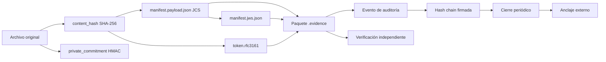

```text
╔══════════════════════════════════════════════════════════════════════════╗
║                                                                          ║
║   ███████╗██╗   ██╗██╗██████╗ ███████╗███╗   ██╗ ██████╗███████╗         ║
║   ██╔════╝██║   ██║██║██╔══██╗██╔════╝████╗  ██║██╔════╝██╔════╝         ║
║   █████╗  ██║   ██║██║██║  ██║█████╗  ██╔██╗ ██║██║     █████╗           ║
║   ██╔══╝  ╚██╗ ██╔╝██║██║  ██║██╔══╝  ██║╚██╗██║██║     ██╔══╝           ║
║   ███████╗ ╚████╔╝ ██║██████╔╝███████╗██║ ╚████║╚██████╗███████╗         ║
║   ╚══════╝  ╚═══╝  ╚═╝╚═════╝ ╚══════╝╚═╝  ╚═══╝ ╚═════╝╚══════╝         ║
║                                                                          ║
║   I N T E G R I T Y   O S   ::   v0.0.1                                  ║
║   cadena de custodia digital verificable                                 ║
║                                                                          ║
╚══════════════════════════════════════════════════════════════════════════╝
```

**Plataforma de integridad, trazabilidad y verificación de evidencia digital para México y Latinoamérica.**

```text
[ HASH ]  SHA-256 + HMAC          [ TIME ]  RFC 3161
[ PROOF ] .evidence               [ AUDIT ] Hash Chain
[ FORM  ] JCS RFC 8785            [ SIGN  ] JWS RFC 7797
[ PADES ] ETSI EN 319 142-1       [ PAGOS ] Mercado Pago
```


```text
> WARNING: Evidence Integrity OS no sustituye a abogado, perito, notario
> ni Prestador de Servicios de Certificación (PSC). Los sellos RFC 3161 y
> las constancias NOM-151 son emitidos exclusivamente por terceros
> autorizados.
```

---

```text
┌─[ 01 ]───────────────────────────────────────────────────────────── MISIÓN ─┐
│                                                                             │
│  Preservar evidencia digital de forma verificable, trazable y               │
│  exportable, minimizando la necesidad de confiar ciegamente en una          │
│  sola plataforma.                                                           │
│                                                                             │
└─────────────────────────────────────────────────────────────────────────────┘
```

```text
ARCHIVO ORIGINAL
       │
       ├──▶ content_hash       (SHA-256, verificable por terceros)
       ├──▶ private_commitment (HMAC-SHA256 vía KMS, prueba privada)
       ├──▶ token.rfc3161      (TSA externa, vinculado al hash)
       ├──▶ evidence-report.pdf (PAdES-B-T: firma + sello de tiempo)
       ├──▶ evento encadenado + anclaje externo
       └──▶ cierre firmado del log de auditoría
       │
       ▼
PAQUETE .evidence VERIFICABLE
```

---

```text
┌─[ 02 ]───────────────────────────────────────────────────────── QUÉ HACE ─┐
│                                                                            │
└────────────────────────────────────────────────────────────────────────────┘
```

| Módulo | Función |
|--------|---------|
| 📦 **Paquete `.evidence`** | Convierte archivos en paquetes verificables e independientes. |
| 🔒 **Integridad** | Calcula `content_hash` (SHA-256) y `private_commitment` (HMAC, prueba privada). |
| 🕐 **Tiempo** | Integra sellos RFC 3161 emitidos por una TSA externa. |
| 📄 **Reporte** | Genera `evidence-report.pdf` con firma PAdES-B-T. |
| ⛓️ **Auditoría** | Registra eventos en hash chain con firma por evento y cierres periódicos. |
| 🌐 **Verificación** | Ofrece consulta pública mínima, solo con consentimiento explícito. |
| 💳 **Pagos** | Gestiona órdenes, webhooks e idempotencia para la emisión. |
| 🔌 **API HTTP** | Expone órdenes, evidencia, webhook, verificación pública y admin. |

---

```text
┌─[ 03 ]────────────────────────────────────────────────────── LÍMITES ─┐
│                                                                        │
└────────────────────────────────────────────────────────────────────────┘
```

| ✅ ESTE SISTEMA SÍ | ❌ ESTE SISTEMA NO |
|--------------------|--------------------|
| Vincula un hash con una fecha/hora verificable mediante token RFC 3161 emitido por una TSA externa. | No certifica autoría, titularidad ni veracidad del contenido. |
| Conserva artefactos criptográficos para revisión independiente. | No emite constancias NOM-151 (solo un PSC acreditado puede hacerlo). |
| Mantiene trazabilidad operativa y eventos auditables. | No garantiza la admisibilidad judicial de una prueba. |
| Facilita verificación técnica reproducible por terceros. | No sustituye asesoría jurídica, pericial o notarial. |

```text
> CAUTION: La valoración de una evidencia depende del contexto, la cadena
> de custodia, la normativa aplicable y la autoridad competente.
```

---

```text
┌─[ 04 ]───────────────────────────────────── CONTENIDO DEL PAQUETE ─┐
│                                                                     │
└─────────────────────────────────────────────────────────────────────┘
```

```text
paquete.evidence
├── manifest.payload.json       ← Metadatos y hashes canónicos (JCS, RFC 8785)
├── manifest.jws.json           ← Firma JWS detached (RFC 7797, b64=false)
├── token.rfc3161               ← Sello de tiempo RFC 3161 (ASN.1 DER)
├── evidence-report.pdf         ← Reporte técnico PAdES-B-T
├── proofs/
│   ├── chain_<position>.json   ← Entrada de hash chain
│   └── anchor_<position>.json  ← Anclaje externo (opcional)
├── signatures/
│   ├── signing_cert.pem        ← Certificado de firma
│   └── ca_chain.pem            ← Cadena de confianza
├── original/                   ← OPCIONAL, desactivado en MVP
└── README.txt                  ← Instrucciones de verificación
```

```text
> NOTA: El archivo original NO se incluye por defecto. El MVP lo desactiva.
> Verificar la estructura, firmas y sellos NO requiere el original.
> Comparar un archivo específico contra el paquete SÍ requiere recalcular
> su content_hash.
```

### Perfiles PAdES

```text
  PAdES-B-B    ──▶  firma sin sello de tiempo
  PAdES-B-T    ──▶  firma + sello RFC 3161              ◀── MVP
  PAdES-B-LT   ──▶  B-T + OCSP/CRL embebidos en el PDF
  PAdES-B-LTA  ──▶  B-LT + sellos de archivo periódicos
```

Un `ocsp.der` en `proofs/` **no convierte** el PDF en B-LT. El material de validación debe embeberse en el PDF según ETSI EN 319 142-1.

---

```text
┌─[ 05 ]────────────────────────────────── ARQUITECTURA DE CONFIANZA ─┐
│                                                                     │
└─────────────────────────────────────────────────────────────────────┘
```



### Naturaleza de las pruebas

| Elemento | Naturaleza | Verificable por |
|----------|-----------|-----------------|
| `content_hash` (SHA-256) | Prueba pública e interoperable | Cualquiera con el archivo original |
| `private_commitment` (HMAC) | Prueba privada controlada por el sistema | Solo el sistema/titular autorizado |
| `token.rfc3161` | Vinculación temporal emitida por TSA externa | Cualquiera con el token |
| `manifest.jws.json` | Firma de integridad del manifiesto | Cualquiera con la clave pública |
| `evidence-report.pdf` | Reporte técnico con firma PAdES-B-T | Cualquiera con Adobe Reader o equivalente |
| `audit.log.jsonl` | Log encadenado con firma por evento | Cualquiera con la clave pública |
| `close_*.bin` | Cierre firmado y anclado externamente | Cualquiera con acceso al anclaje |

```text
> SOBRE EL HMAC: private_commitment es una prueba privada que aporta
> control adicional del titular. NO protege al content_hash público
> contra ataques de diccionario. Si el archivo tiene baja entropía, el
> content_hash público sigue siendo comprobable por terceros mediante
> diccionario.
```

---

```text
┌─[ 06 ]─────────────────────────────────────── MARCO DE REFERENCIA ─┐
│                                                                     │
└─────────────────────────────────────────────────────────────────────┘
```

### Alineación de diseño con normativa mexicana

```text
> "Alineación de diseño" significa que el sistema se construye considerando
> estas normas. NO implica cumplimiento certificado, ni admisibilidad
> automática, ni respaldo oficial.
```

| Norma | Materia |
|-------|---------|
| **NOM-151-SCFI-2016** (DOF 30/03/2017) | Conservación de mensajes de datos. Constancia emitida por PSC acreditado. |
| **Código de Comercio, Art. 97** | Uso de firma electrónica en mensajes de datos. |
| **CNPP, Art. 265** | Valoración de datos y pruebas. |
| **LFPDPPP** | Protección de datos personales en posesión de particulares. |

### Estándares internacionales

```text
  RFC 3161              ──▶  Time-Stamp Protocol (TSP)
  RFC 8785              ──▶  JSON Canonicalization Scheme (JCS)
  RFC 7797              ──▶  JWS Unencoded Payload Option
  RFC 7515 / 7518 / 7638 ──▶  JWS, algoritmos, thumbprints
  ETSI EN 319 142-1     ──▶  Perfiles PAdES
  ISO/IEC 27001         ──▶  Gestión de seguridad (referencia)
  ISO/IEC 27037         ──▶  Guía forense digital (referencia)
```

```text
> Ninguna de estas referencias implica certificación. Solo describen el
> marco técnico sobre el cual se diseña el sistema.
```

---

```text
┌─[ 07 ]─────────────────────────────────────── ESTADO DEL PROYECTO ─┐
│                                                                     │
└─────────────────────────────────────────────────────────────────────┘
```

| Componente | Estado |
|------------|--------|
| Núcleo criptográfico | ✅ hashing, KMS, JCS, manifest, JWS, timestamp, hash_chain |
| Log de auditoría | ✅ logger encadenado + anclaje externo + verificación |
| Empaquetado `.evidence` | ✅ builder + verifier + CLI |
| Procesador de pagos | ✅ webhook, validación, fulfillment, worker, recovery |
| API HTTP | ✅ FastAPI: orders, evidence, webhook, public, admin |
| Tests de seguridad | ✅ algorithm confusion, dictionary attack, corruption, schema |
| Migraciones SQL | ✅ 5/5 aprobadas |
| UI | ✅ Landing estática con tema claro/oscuro |
| Revisión legal México | ⚠️ Bloqueante externo |

### Barra de progreso

```text
  Núcleo criptográfico  ████████████████████████████████████ 100%
  Log de auditoría      ████████████████████████████████████ 100%
  Empaquetado .evidence ████████████████████████████████████ 100%
  Procesador de pagos   ████████████████████████████████████ 100%
  API HTTP              ████████████████████████████████████ 100%
  Tests de seguridad    ████████████████████████████████████ 100%
  Migraciones SQL       ████████████████████████████████████ 100%
  UI (landing)          ████████████████████████████████████ 100%
  Revisión legal MX     ░░░░░░░░░░░░░░░░░░░░░░░░░░░░░░░░░░░░   0%
```

---

```text
┌─[ 08 ]──────────────────────────────────────────────────────────── DEMO ─┐
│                                                                          │
└──────────────────────────────────────────────────────────────────────────┘
```

```text
> DESPLIEGUE PENDIENTE. La landing pública se activará cuando el
> repositorio complete su revisión técnica y legal.
```

### Verificar un paquete `.evidence`

```bash
$ pip install -e ".[dev]"
$ evidence-verify --package caso.evidence
```

Salida esperada:

```text
[1/7] estructura ................ ok
[2/7] manifest.canonical ........ ok
[3/7] manifest.schema ........... ok
[4/7] jws ....................... ok (firma valida)
[5/7] rfc3161.imprint ........... ok
[6/7] hash_chain ................ ok
[7/7] operational ............... ok (revocacion: active)

-> RESULTADO: VALIDO
   evidence_id:     ev_abc12345
   manifest_digest: 9ca381f592b6117e8bd4adcde10cffe3c5eda50c...
   tsa_gen_time:    2026-09-13T12:00:02+00:00
   revocacion:      active
```

### Verificar el log de auditoría

```bash
$ python -m src.audit.integrity --log audit.jsonl --closes closes.jsonl --anchor ./anchors
```

Salida esperada:

```text
[1/4] read ...................... ok (1247 eventos)
[2/4] chain ..................... ok
[3/4] event_signatures .......... ok
[4/4] closes .................... ok (12 cierres)

-> RESULTADO: VALIDO
   event_count:     1247
   close_count:     12
   last_event_hash: 8f3a...
```

### Demo rápida en Windows

```cmd
scripts\demo_build_verify.cmd
```

---

```text
┌─[ 09 ]───────────────────────────────────────── SEGURIDAD Y PRIVACIDAD ─┐
│                                                                         │
└─────────────────────────────────────────────────────────────────────────┘
```

Si detectas una vulnerabilidad, **no publiques detalles sensibles en un issue público**. Consulta [`SECURITY.md`](SECURITY.md) para el canal de reporte responsable.

```text
  ✔ Minimización de datos              ✔ Control de acceso por rol
  ✔ Cifrado en tránsito                ✔ Registro de accesos y operaciones
  ✔ Políticas de retención             ✔ Revisión con especialistas LFPDPPP
  ✔ Separación de hashes y datos       ✔ Enlaces públicos revocables
```

### Comandos de verificación segura

```bash
# Verificar el log de auditoría completo
pytest tests/unit tests/security -v

# Analizar seguridad estática
bandit -c pyproject.toml -r src

# Auditar dependencias
pip-audit

# Generar SBOM
make sbom
```

---

```text
┌─[ 10 ]────────────────────────────────────────────────────── HOJA DE RUTA ─┐
│                                                                            │
└────────────────────────────────────────────────────────────────────────────┘
```

```text
  [x]  Definir manifest.payload.json v1
  [x]  Documentar límites legales y no-objetivos
  [x]  Congelar arquitectura de pagos
  [x]  Implementar núcleo criptográfico (hashing, JCS, JWS, TSA, hash chain)
  [x]  Implementar log de auditoría encadenado con anclaje externo
  [x]  Implementar empaquetado .evidence (builder + verifier)
  [x]  Implementar verificador CLI independiente
  [x]  Finalizar migraciones SQL versionadas (5/5 aprobadas)
  [x]  Implementar procesador de pagos (webhook, validación, fulfillment, worker, recovery)
  [x]  Implementar API HTTP pública
  [x]  Añadir pruebas de seguridad (algorithm confusion, dictionary attack, corruption)
  [ ]  Añadir pruebas de integración contra PostgreSQL real
  [ ]  Añadir pruebas de concurrencia y recovery end-to-end
  [ ]  Pruebas cruzadas Python ↔ Rust/Node
  [ ]  Integrar TSA y proveedor de firma con credenciales reales
  [ ]  Implementar AWSKMS real
  [ ]  Implementar S3ObjectLockAnchor real
  [ ]  Completar revisión legal, de privacidad y seguridad externa
```

---

```text
┌─[ 11 ]────────────────────────────────────────────────────────── CONTRIBUIR ─┐
│                                                                              │
└──────────────────────────────────────────────────────────────────────────────┘
```

```text
> IMPORTANTE: Contribuciones externas no aceptadas en la fase actual.
> El proyecto no cuenta aún con canal de moderación formalizado ni equipo
> de revisión asignado. Consulta CONTRIBUTING.md para el proceso previsto.
```

Antes de contribuir (cuando se abra el canal):

1. Lee [`CONTRIBUTING.md`](CONTRIBUTING.md) y [`CODE_OF_CONDUCT.md`](CODE_OF_CONDUCT.md).
2. No incluyas secretos, certificados privados ni evidencia real.
3. Usa únicamente datos sintéticos en ejemplos y pruebas.
4. Documenta decisiones que afecten formatos, algoritmos o compatibilidad.

---

```text
┌─[ 12 ]───────────────────────────────────────────────────────────── LICENCIA ─┐
│                                                                              │
└──────────────────────────────────────────────────────────────────────────────┘
```

```text
  Código          ──▶  MIT (LICENSE)
  Documentación   ──▶  CC-BY-4.0 (LICENSE-DOCS.md)
```

---

```text
╔══════════════════════════════════════════════════════════════════════════╗
║                                                                          ║
║   [ EVIDENCE INTEGRITY OS ]                                              ║
║                                                                          ║
║   Integridad verificable.                                                ║
║   Trazabilidad responsable.                                              ║
║   Sin promesas jurídicas automáticas.                                    ║
║                                                                          ║
║   root@evidence:~# ./verify --integrity                                  ║
║   █                                                                      ║
║                                                                          ║
╚══════════════════════════════════════════════════════════════════════════╝
```
